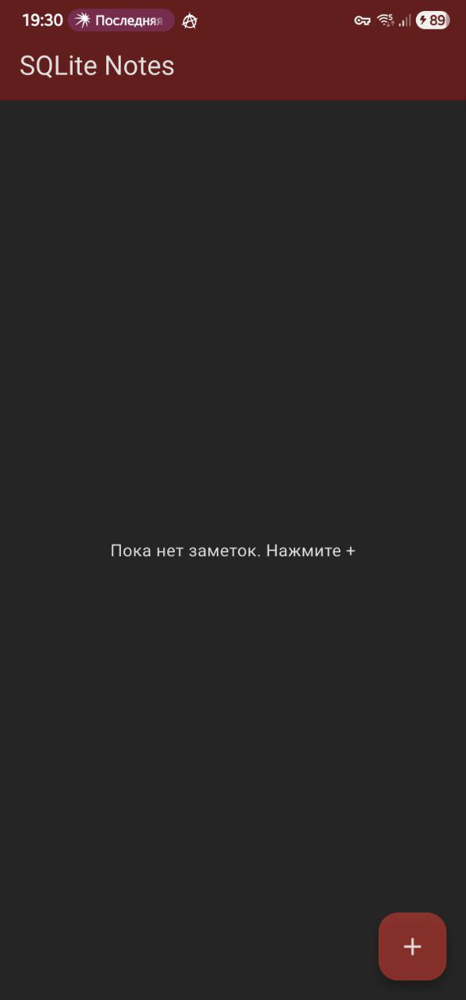
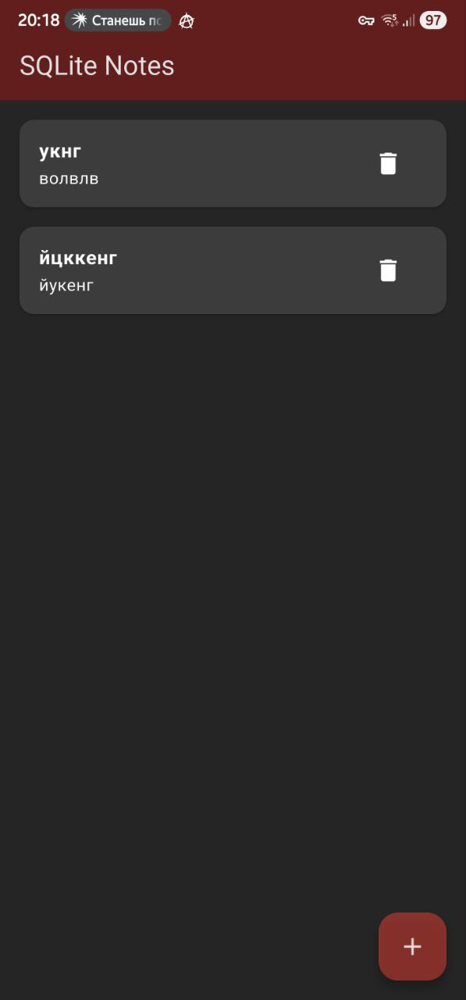
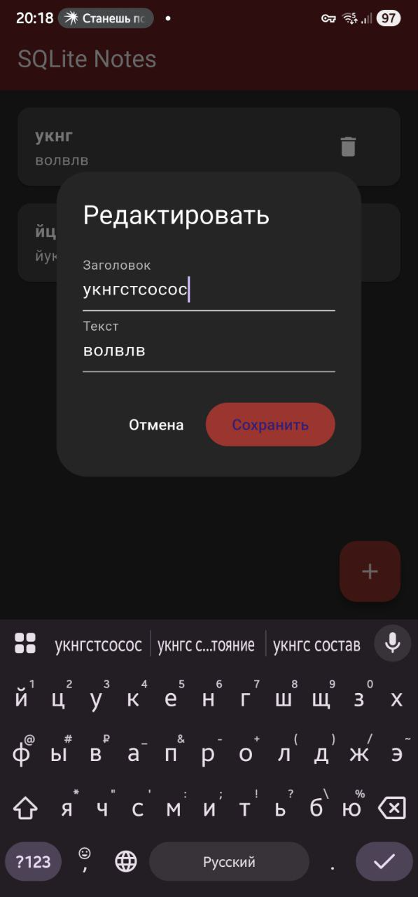
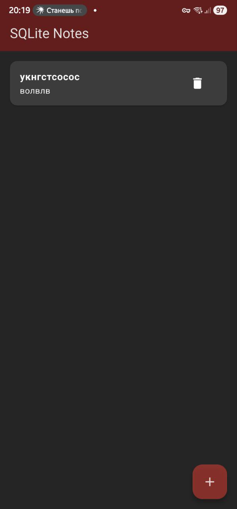

# Notes SQLite App

## Отчет по Практическому Занятию № 10: Работа с базами данных. Подключение к SQLite

### Cкриншоты
Скриншот приложения с пустым списком (первый запуск):


Скриншот после добавления заметки:


Скриншот окна редактирования и итоговой записи:


Скриншот после удаления заметки:


### 1. Структура проекта и зависимости

Проект был создан с использованием `flutter create`. Была организована следующая структура каталогов для разделения слоев приложения:
- `lib/data/`: для логики работы с базой данных (`db_helper.dart`).
- `lib/models/`: для модели данных (`note.dart`).
- `lib/pages/`: для UI-компонентов (`notes_page.dart`).

В `pubspec.yaml` были добавлены необходимые зависимости для работы с SQLite:
```yaml
dependencies:
  sqflite: ^2.3.3
  path: ^1.9.0
  path_provider: ^2.1.4
```

### 2. Слой данных (Data Layer)

#### Модель `Note` (`lib/models/note.dart`)
Создана модель `Note` для представления заметки. Она включает методы `toMap()` и `fromMap()` для преобразования объекта в/из формата, совместимого с базой данных. Даты хранятся в виде `INTEGER` (Unix timestamp в миллисекундах).

#### `DBHelper` (`lib/data/db_helper.dart`)
Этот класс инкапсулирует всю логику взаимодействия с SQLite.
- **Открытие БД:** Метод `_open()` использует `path_provider` для определения пути к файлу базы данных и открывает соединение.
- **Создание таблицы:** В колбэке `onCreate` создается таблица `notes` и индекс по полю `created_at` для ускорения сортировки.
  ```sql
  CREATE TABLE notes (
    id INTEGER PRIMARY KEY AUTOINCREMENT,
    title TEXT NOT NULL,
    body TEXT NOT NULL,
    created_at INTEGER NOT NULL,
    updated_at INTEGER NOT NULL
  );
  CREATE INDEX idx_notes_created_at ON notes(created_at DESC);
  ```
- **CRUD-операции:** Реализованы статические методы для всех CRUD-операций: `insertNote`, `fetchNotes`, `updateNote`, `deleteNote`.

### 3. Пользовательский интерфейс (UI)

UI реализован в `lib/pages/notes_page.dart`.
- **Отображение списка:** Вместо `StreamBuilder` (как в предыдущих работах с облачными БД) используется `FutureBuilder`. Он асинхронно получает список заметок с помощью `DBHelper.fetchNotes()`.
- **Обновление UI:** Поскольку `sqflite` не предоставляет потоков данных (streams) "из коробки", UI необходимо обновлять вручную. Для этого создан метод `_reload()`, который вызывает `setState`, заново запуская `Future` и перестраивая `FutureBuilder`.
  ```dart
  void _reload() {
    setState(() {
      _notesFuture = DBHelper.fetchNotes();
    });
  }
  ```
- **Добавление/Редактирование:** Для создания и редактирования заметок используется диалоговое окно `AlertDialog`. После успешного сохранения или обновления данных вызывается `_reload()`, чтобы немедленно отобразить изменения в списке.

### 4. Выводы

В ходе работы было создано приложение, использующее локальную базу данных SQLite. Ключевое отличие от облачных сервисов (Firebase, Supabase) — это необходимость ручного управления состоянием и обновления UI, так как `sqflite` не предоставляет потоковую архитектуру по умолчанию. Слой данных был успешно отделен от UI с помощью класса-помощника `DBHelper`, что улучшает структуру и тестируемость кода.