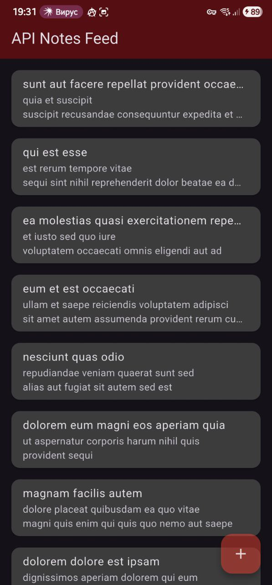
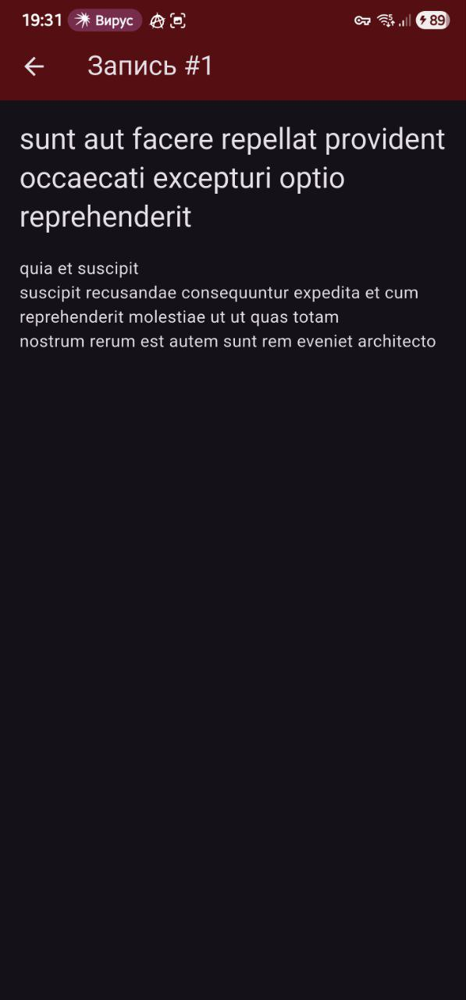
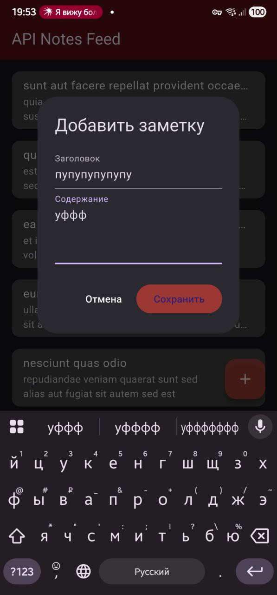
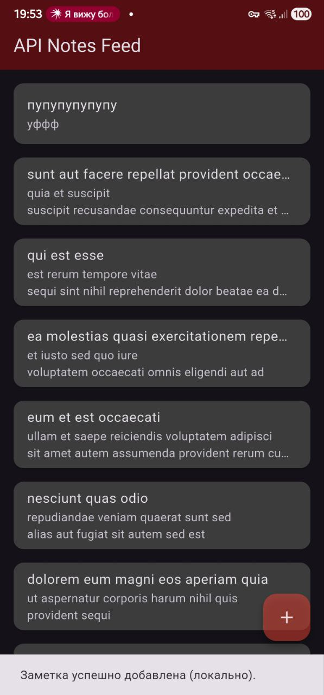

# API Notes App

## Отчет по Практическому Занятию № 11: Основы работы с API (HTTP/REST)

### Cкриншоты
Скриншот экрана списка:


Скриншот экрана деталей:


Скриншот диалога создания и результата (новый элемент в списке):



### 1. Архитектура и зависимости

Проект использует многослойную архитектуру для разделения ответственности, как было предложено в задании:
-   **UI Layer (`pages`):** Отвечает за отображение данных и взаимодействие с пользователем.
-   **Repository Layer (`data/notes_repository.dart`):** Бизнес-логика, которая предоставляет UI-слою данные, абстрагируясь от их источника.
-   **API Client Layer (`data/api_client.dart`):** Отвечает за непосредственное взаимодействие с REST API, настройку HTTP-клиента и обработку запросов.

Основной зависимостью для работы с сетью был выбран пакет `dio`. Он был добавлен в `pubspec.yaml`:
```yaml
dependencies:
  dio: ^5.9.0
```

### 2. Слой данных

#### `ApiClient` (`lib/data/api_client.dart`)
Этот класс настраивает и инкапсулирует HTTP-клиент `dio`. В качестве источника данных был выбран **Вариант А**: публичный API `jsonplaceholder`.
-   `baseUrl`: `https://jsonplaceholder.typicode.com`
-   Установлены таймауты на соединение и получение данных (10 секунд).
-   Добавлен `Interceptor` для логирования всех запросов, ответов и ошибок в консоль, что упрощает отладку.

#### `NotesRepository` (`lib/data/notes_repository.dart`)
Репозиторий использует `ApiClient` для выполнения запросов. Реализованы следующие методы:
-   `Future<List<Note>> list({int page, int limit})`: Загружает список постов с пагинацией.
-   `Future<Note> get(int id)`: Загружает один пост по его `id`.
-   Методы `create`, `update`, `delete` также реализованы для демонстрации, но они не изменяют данные на сервере `jsonplaceholder`, а лишь возвращают фиктивный успешный ответ, как и описано в API.

#### `Note` Model (`lib/models/note.dart`)
Модель `Note` содержит поля `id`, `title`, `body` и фабричный конструктор `fromJson` для парсинга ответа от API.

### 3. Пользовательский интерфейс (UI)

#### `NotesPage` (`lib/pages/notes_page.dart`)
Это главный экран, который отображает ленту постов.
-   **Пагинация:** Реализована "бесконечная прокрутка". При достижении конца списка автоматически подгружается следующая "страница" данных с помощью метода `_loadMore()`.
-   **Состояния:** Экран обрабатывает состояния загрузки (`_loading`, `_isFirstLoad`) и ошибок, показывая либо индикатор загрузки, либо сообщение об ошибке через `SnackBar`.
-   **Pull-to-Refresh:** С помощью виджета `RefreshIndicator` реализовано обновление списка "потягиванием вниз".
-   **Навигация:** При нажатии на элемент списка происходит переход на экран `NoteDetailsPage`.

#### `NoteDetailsPage` (`lib/pages/note_details_page.dart`)
Экран для просмотра полной информации о посте. Использует `FutureBuilder` для асинхронной загрузки данных о конкретном посте по его `id`.

### 4. Выводы

В ходе работы было создано приложение, которое получает данные из внешнего REST API. Была применена архитектура с разделением слоев (UI, Repository, API Client), что делает код более чистым, модульным и тестируемым. Реализован функционал пагинации для эффективной загрузки данных и pull-to-refresh для удобного обновления. Использование `dio` и `Interceptors` позволило легко настроить HTTP-клиент и добавить логирование для отладки.