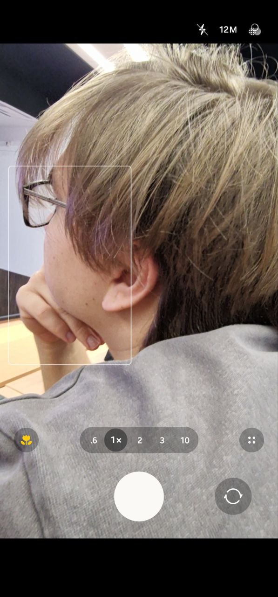
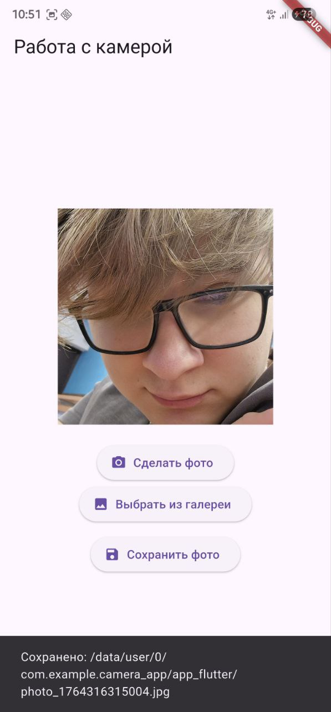

# Отчёт по практической работе №12  
Выполнил: студент группы ЭФБО-10-23 Никитин Артемий Андреевич  

## Цели работы
- Изучить архитектуру и основные возможности аппаратной части современных мобильных устройств.  
- Ознакомиться с API для работы с камерой и галереей в экосистеме Flutter.  
- Научиться создавать мобильные приложения, использующие камеру и хранилище устройства.  
- Освоить механизмы запроса системных разрешений, обработки и сохранения изображений.

## Ход выполнения работы

## скриншоты
Интерфейс (главный экран):


Камера в действии:


Отображение выбранного фото:



### 1. Подготовка проекта и установка зависимостей
Создан новый проект командой  
`flutter create camera_app`

В файл `pubspec.yaml` добавлены следующие зависимости:

```yaml
dependencies:
  flutter:
    sdk: flutter
  image_picker: ^1.1.1
  permission_handler: ^11.3.0 
  path_provider: ^2.1.4
```

### 2. Настройка системных разрешений

```xml
<uses-permission android:name="android.permission.CAMERA"/>
<uses-permission android:name="android.permission.READ_EXTERNAL_STORAGE"/>
<uses-permission android:name="android.permission.WRITE_EXTERNAL_STORAGE"/>
```

### 3. Реализация функциональности приложения

Приложение реализовано на одном экране `CameraPage` (StatefulWidget).  

Основные элементы интерфейса:
- Область отображения выбранного изображения (или текст «Фото не выбрано»).  
- Кнопка «Сделать фото» → вызов камеры.  
- Кнопка «Выбрать из галереи» → открытие фотогалереи.  
- Кнопка «Сохранить фото» → копирование изображения в постоянное хранилище приложения.


## Вывод

В ходе выполнения практической работы была изучена аппаратная архитектура мобильных устройств и принципы доступа к ней из Flutter-приложений через плагины. Освоены пакеты `image_picker`, `permission_handler` и `path_provider`. Реализовано полнофункциональное приложение для съёмки, выбора и сохранения фотографий с корректной обработкой системных разрешений.
