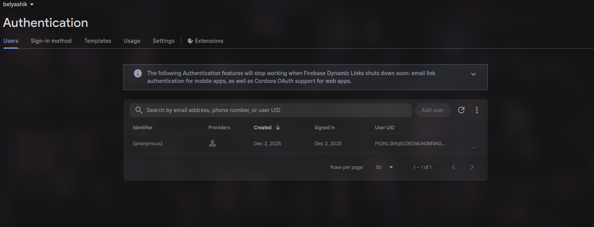
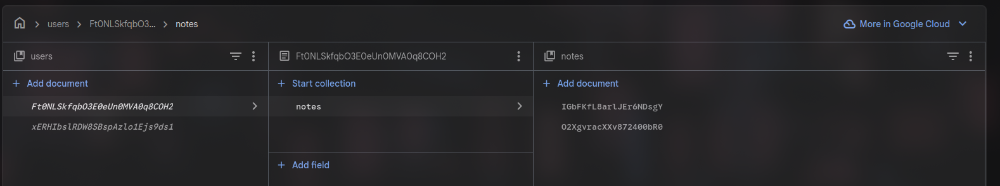
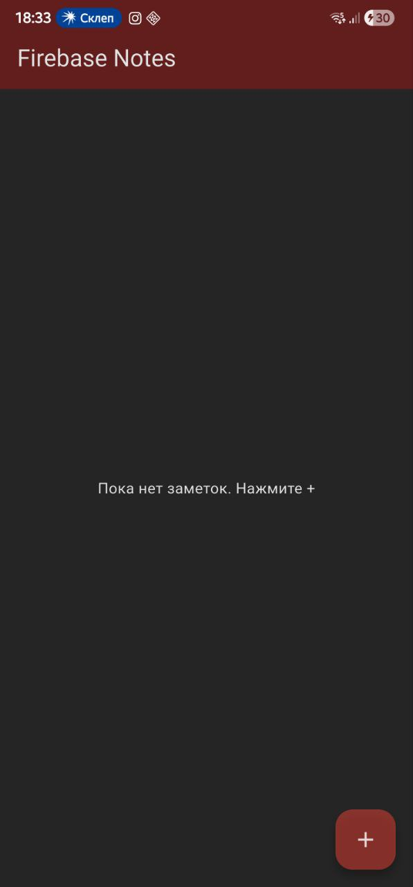
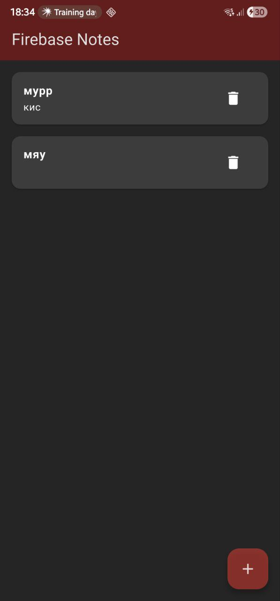
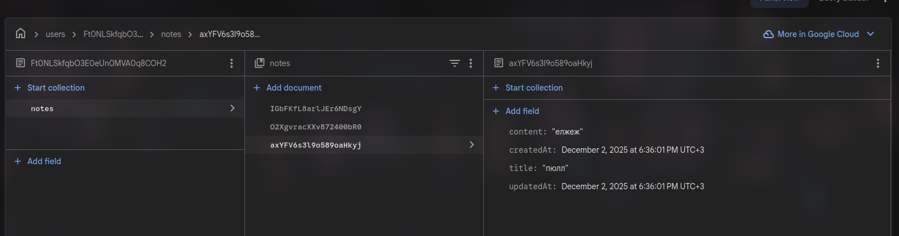
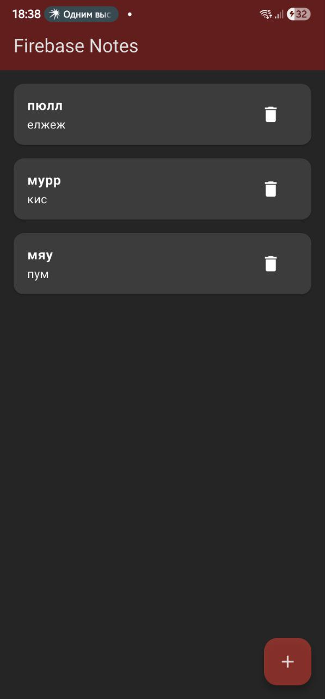
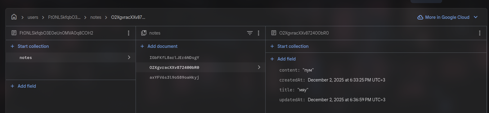
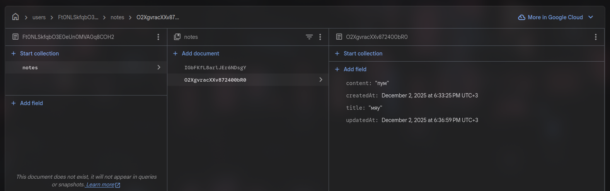
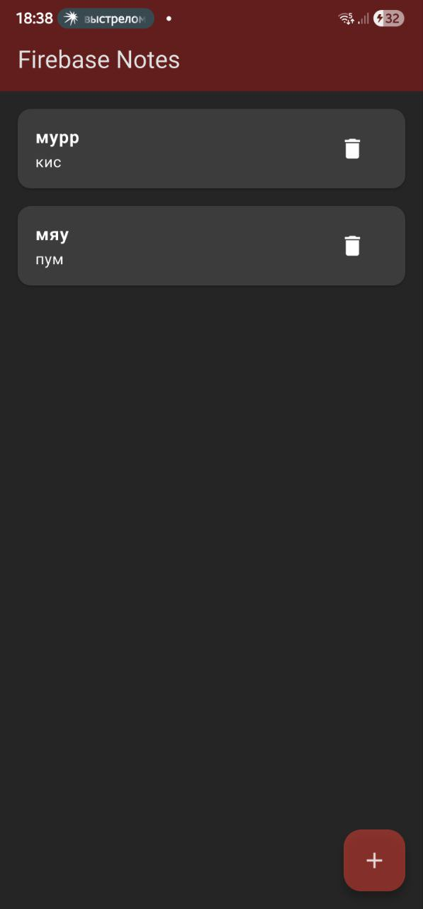

# Firebase Notes App

## Отчет по Практическому Занятию № 8: Работа с базами данных. Подключение приложения к Firebase
Анонимная аутентификация


Скриншот настроенного проекта Firebase:


Скриншот запущенного приложения:




Скриншот после добавления и редактирования заметки:




Скриншот после удаления заметки:




### 1. Создание и привязка Firebase-проекта

Проект Flutter `firebase_notes_app` был создан. Интеграция с Firebase была выполнена с использованием `FlutterFire CLI`.

1.  Установлен `flutterfire_cli` командой: `dart pub global activate flutterfire_cli`
2.  Выполнена настройка проекта Firebase командой: `flutterfire configure`
  
### 2. Использованные пакеты и инициализация Firebase

В `pubspec.yaml` были добавлены следующие зависимости:

```yaml
dependencies:
  flutter:
    sdk: flutter
  cupertino_icons: ^1.0.8
  firebase_core: ^latest_version
  cloud_firestore: ^latest_version
  firebase_auth: ^latest_version
```

Инициализация Firebase и анонимный вход были выполнены в функции `main()` файла `lib/main.dart`:

```dart
void main() async {
  WidgetsFlutterBinding.ensureInitialized();
  await Firebase.initializeApp(
    options: DefaultFirebaseOptions.currentPlatform,
  );
  await FirebaseAuth.instance.signInAnonymously(); 
  runApp(const MyApp());
}
```

### 3. Структура коллекций/документов

Заметки хранятся в Firestore с учетом владения пользователем. Структура коллекции: `users/{userId}/notes/{noteId}`.

Каждый документ заметки (`noteId`) в подколлекции `notes` содержит следующие поля:
*   `title` (string): Заголовок заметки.
*   `content` (string): Содержимое заметки.
*   `createdAt` (timestamp): Время создания заметки.
*   `updatedAt` (timestamp): Время последнего обновления заметки.

`userId` берется из `FirebaseAuth.instance.currentUser!.uid`, что позволяет каждому пользователю (в данном случае, анонимному) иметь свои собственные заметки.

### 4. Правила безопасности Firestore

Для обеспечения владения данными пользователя были установлены следующие правила безопасности Firestore:

```
rules_version = '2';
service cloud.firestore {
  match /databases/{database}/documents {
    match /users/{userId}/notes/{noteId} {
      allow read, write: if request.auth != null && request.auth.uid == userId;
    }
  }
}
```

**Недостаточность для продакшена:** Эти правила гарантируют, что только аутентифицированный пользователь может читать и записывать свои собственные заметки. Однако, для реального продакшен-приложения этого недостаточно. Например, здесь нет проверки на формат данных, размер документа, количество записей, а также отсутствуют более сложные механизмы авторизации (например, на основе ролей). Также, использование анонимной аутентификации может быть нежелательным для некоторых приложений.

### 5. Ошибки и их решения

  **`flutterfire` command not found:** Изначально команда `flutterfire` не была доступна. Проблема решена активацией CLI: `dart pub global activate flutterfire_cli` и добавлением пути `$HOME/.pub-cache/bin` в переменную окружения `PATH` для текущей сессии.

---
