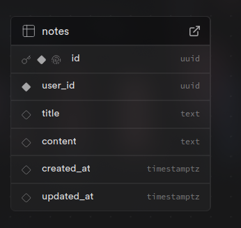
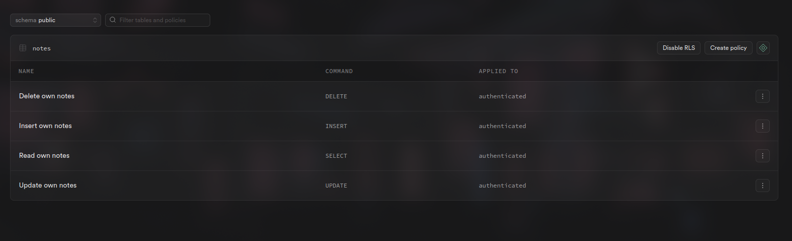
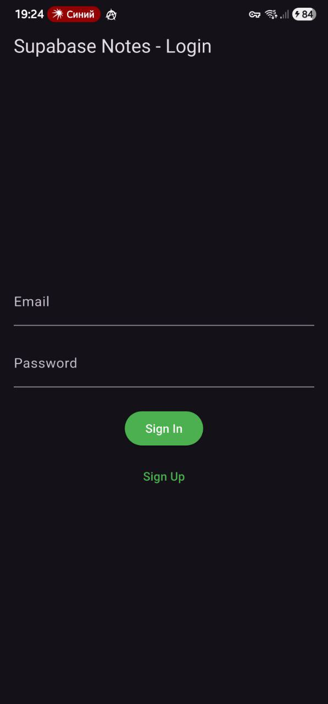
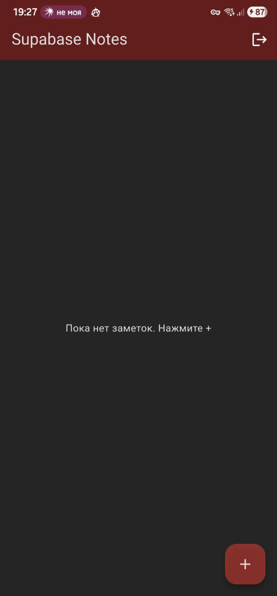
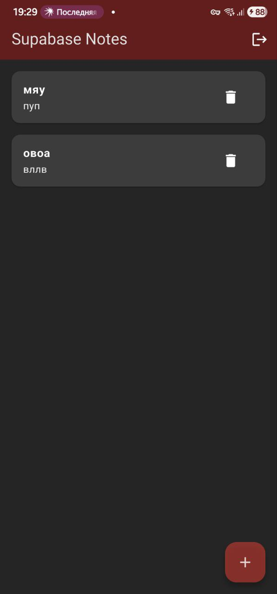
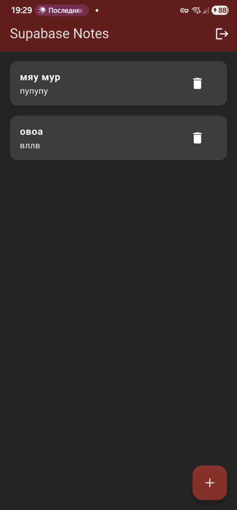
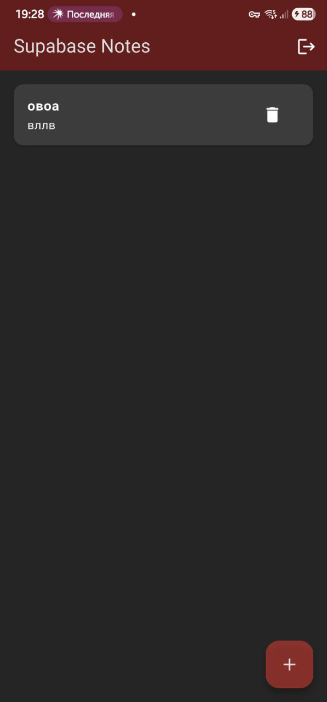

# Supabase Notes App

## Отчет по Практическому Занятию № 9: Работа с базами данных. Подключение приложения к Supabase

### скриншоты

Скриншот настроенного проекта Supabase 



Скриншот экрана входа и экрана со списком


Скриншот после добавления заметки


Скриншот после редактирования заметки


Скриншот после удаления заметки



### 1. Подключение Supabase

1.  **Создание проекта:** Был создан новый проект в [консоли Supabase](https://supabase.com/).
2.  **Получение ключей:** Из настроек проекта (Project Settings -> API) были получены **Project URL** и **anon (public) key**.
3.  **Создание таблицы `notes`:** В редакторе таблиц (Table Editor) была создана таблица `notes` со следующей схемой:
    *   `id` (uuid, Primary Key)
    *   `user_id` (uuid)
    *   `title` (text)
    *   `content` (text)
    *   `created_at` (timestamptz)
    *   `updated_at` (timestamptz)

### 2. Зависимости и инициализация

В `pubspec.yaml` была добавлена зависимость `supabase_flutter`:

```yaml
dependencies:
  supabase_flutter: ^2.0.0 
```

Инициализация Supabase была выполнена в `lib/main.dart` перед запуском приложения:

```dart
void main() async {
  WidgetsFlutterBinding.ensureInitialized();
  await Supabase.initialize(
    url: dotenv.env['SUPABASE_URL'],
    anonKey: dotenv.env['SUPABASE_ANON_KEY'],
  );
  runApp(const MyApp());
}
```

### 3. Структура таблицы и RLS-политики

Для таблицы `notes` была включена **Row Level Security (RLS)** для обеспечения безопасности данных. Были созданы следующие политики, которые разрешают пользователям доступ только к своим собственным заметкам:

1.  **Read own notes (`SELECT`):**
    ```sql
    create policy "Read own notes" on public.notes for select
    to authenticated using (user_id = auth.uid());
    ```
2.  **Insert own notes (`INSERT`):**
    ```sql
    create policy "Insert own notes" on public.notes for insert
    to authenticated with check (user_id = auth.uid());
    ```
3.  **Update own notes (`UPDATE`):**
    ```sql
    create policy "Update own notes" on public.notes for update
    to authenticated using (user_id = auth.uid());
    ```
4.  **Delete own notes (`DELETE`):**
    ```sql
    create policy "Delete own notes" on public.notes for delete
    to authenticated using (user_id = auth.uid());
    ```

### 4. Реализация функционала

*   **Аутентификация:** Создан виджет `AuthGate` (`lib/auth_gate.dart`), который отслеживает состояние аутентификации пользователя (`Supabase.instance.client.auth.onAuthStateChange`). Если пользователь не аутентифицирован, отображается `LoginPage` с формой входа и регистрации по email/паролю. После успешного входа или регистрации пользователь перенаправляется на `NotesPage`.
*   **CRUD и Realtime:** `NotesPage` была переработана для работы с Supabase.
    *   Для получения данных в реальном времени используется `StreamBuilder`, который подписывается на поток изменений из таблицы `notes` с помощью `.stream(primaryKey: ['id'])`.
    *   CRUD-операции (`insert`, `update`, `delete`) выполняются с использованием клиента Supabase.

